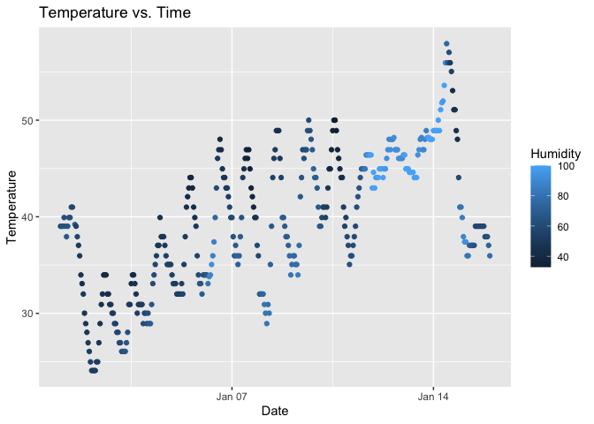

p8105_hw1_lq2250
================
Lanlan_Qing
2025-09-16

    ## ── Attaching core tidyverse packages ──────────────────────── tidyverse 2.0.0 ──
    ## ✔ dplyr     1.1.4     ✔ readr     2.1.5
    ## ✔ forcats   1.0.0     ✔ stringr   1.5.2
    ## ✔ ggplot2   4.0.0     ✔ tibble    3.3.0
    ## ✔ lubridate 1.9.4     ✔ tidyr     1.3.1
    ## ✔ purrr     1.1.0     
    ## ── Conflicts ────────────────────────────────────────── tidyverse_conflicts() ──
    ## ✖ dplyr::filter() masks stats::filter()
    ## ✖ dplyr::lag()    masks stats::lag()
    ## ℹ Use the conflicted package (<http://conflicted.r-lib.org/>) to force all conflicts to become errors

## Problem 1

``` r
# Load the dataset as ejw_df
data("early_january_weather")

ejw_df = early_january_weather
temp = pull(ejw_df, temp)
```

### Description:

The dataset of “early_january_weather” contains **origin, year, month,
day, hour, temp, dewp, humid, wind_dir, wind_speed, wind_gust, precip,
pressure, visib, time_hour** variables.

The dataset is composed of 358 rows and 15 columns.

The mean temperature is 39.58.

``` r
# Made the scatter plot of temp(y) vs time_hour(x)
scatter_plot = ggplot(data = ejw_df,
                      aes(x = time_hour,
                          y = temp,
                          color = humid)) +
  geom_point() +
  labs(title = "Temperature vs. Time",
       x = "Date",
       y = "Temperature",
       color = "Humidity")

ggsave("Plots/scatter_plot.jpg")
```

    ## Saving 7 x 5 in image

``` r
print(scatter_plot)
```

<!-- -->

### Description:

The temperature and time seem to be **positively related**. While time
is increasing, temperature also trends to increase.

## Problem 2

``` r
# Identify the variables
sample_num = rnorm(10)
log_vec = sample_num > 0
cha_vec = c("boy", "girl", "boy", "girl", "girl", "boy", "girl", "boy", "boy", "boy")
fac_vec = factor(c("low", "low", "high", "medium", "high", "high", "medium", "medium", "medium", "medium" ))
sample_df = data.frame(sample_num,
                     log_vec,
                     cha_vec,
                     fac_vec 
                     )
```

The mean of each variable in my data frame is:

- a random sample of size 10 from a standard Normal distribution: 0.14

- a logical vector indicating whether elements of the sample are greater
  than 0: 0.6

- a character vector of length 10: NA

- a factor vector of length 10, with 3 different factor “levels”: NA

**Q. What works and what doesn’t?**

Only the forward two variables of **random sample** and **logical
vector** work. The **character factor** and **factor vector** do not.

    ## Warning in mean(as.numeric(pull(sample_df, cha_vec))): NAs introduced by
    ## coercion

**Q: What happens, and why? Does this help explain what happens when you
try to take the mean?**

- Logical: TRUE becomes 1 and FALSE becomes 0.

- Character: Results in NA with a warning, as non-numeric characters
  can’t be directly converted to numeric.

- Factor: The function converts factors to their internal numeric
  levels.
